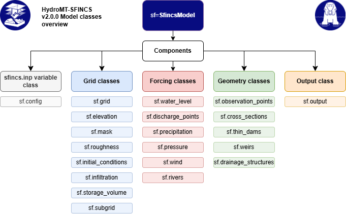

.. _model_components:

Model Components
================

The :py:class:`~hydromt_sfincs.SfincsModel` consists of several components that together
represent the full SFINCS model setup. Each component manages a specific part of the
model (e.g., configuration, grid definition, forcings, or output) and can be read from or
written to disk using the corresponding ``read()`` and ``write()`` methods. Furhermore,
each component has its own ``data`` attribute that stores the relevant data for that component,
and a ``create()`` method to generate or update the component data (see also :ref:`model_methods`).

An overview of all model components is presented in :ref:`hydromt_sfincs_diagram`, and each component
will be introduced in the following sections. For more details about each component,
see the `SFINCS documentation <https://sfincs.readthedocs.io/en/latest/>`_.

.. _hydromt_sfincs_diagram:

   HydroMT-SFINCS workflow diagram

Configuration component
-----------------------
The configuration component manages the main SFINCS configuration settings and parameters. Only files or settings
that are mentioned in the configuration file will be used by the SFINCS model.

.. list-table::
   :widths: 25 35 40
   :header-rows: 1

   * - **Component**
     - **Description**
     - **Associated Files / Relations**
   * - :py:class:`config <hydromt_sfincs.components.config.config.SfincsConfig>`
     - Model configuration settings and parameters.
     - ``sfincs.inp`` (main input file)

Regular grid components
-----------------------
These components define the model grid and its physical parameters for SFINCS models on regular grids.
The different components are interrelated, since they all share the same spatial grid definition.

.. list-table::
   :widths: 25 35 40
   :header-rows: 1

   * - **Component**
     - **Description**
     - **Associated Files / Relations**
   * - :py:class:`grid <hydromt_sfincs.components.grid.regulargrid.SfincsGrid>`
     - Base model grid.
     - ``sfincs.inp``
   * - :py:class:`elevation <hydromt_sfincs.components.grid.elevation.SfincsElevation>`
     - Elevation (bathymetry/topography).
     - ``depfile``
   * - :py:class:`mask <hydromt_sfincs.components.grid.mask.SfincsMask>`
     - Active domain and boundary mask.
     - ``mskfile``, ``indexfile``
   * - :py:class:`roughness <hydromt_sfincs.components.grid.roughness.SfincsRoughness>`
     - Manning’s n roughness.
     - ``manningfile``
   * - :py:class:`infiltration <hydromt_sfincs.components.grid.infiltration.SfincsInfiltration>`
     - Infiltration capacity.
     - ``qinffile``, ``scsfile``, ``ksfile``, ``sefffile``, ``smaxfile``
   * - :py:class:`initial_conditions <hydromt_sfincs.components.grid.initial_conditions.SfincsInitialConditions>`
     - Initial water levels.
     - ``inifile``
   * - :py:class:`storage_volume <hydromt_sfincs.components.grid.storage_volume.SfincsStorageVolume>`
     - Storage volume to account for green infrastructure.
     - ``volfile``
   * - :py:class:`subgrid <hydromt_sfincs.components.grid.subgrid.SfincsSubgridTable>`
     - Subgrid table with cell-specific elevation and roughness data.
     - ``sbgfile``

.. note::

    Please be aware that the ``indexfile`` is not describing a grid variable.
    Instead, it is generated during the writing process based on the ``mskfile``,
    and it is utilized for the purpose of reading grid variables in binary files.

.. note::

    Please be aware the the :py:class:`subgrid <hydromt_sfincs.components.grid.subgrid.SfincsSubgridTable>`
    component has its own data attribute, whereas all other grid components store their data in the
    :py:class:`grid <hydromt_sfincs.components.grid.regulargrid.SfincsGrid>` component.

Geometries and structures
-------------------------
These model components manage vector-based geometries and structures within the SFINCS model, such as
observation points to monitor water levels at specific locations or weirs to represent flow control structures.

.. list-table::
   :widths: 25 35 40
   :header-rows: 1

   * - **Component**
     - **Description**
     - **Associated Files / Relations**
   * - :py:class:`observation_points <hydromt_sfincs.components.geometries.observation_points.SfincsObservationPoints>`
     - Observation points for validation.
     - ``obsfile``
   * - :py:class:`cross_sections <hydromt_sfincs.components.geometries.cross_sections.SfincsCrossSections>`
     - Cross-section definitions.
     - ``crsfile``
   * - :py:class:`weirs <hydromt_sfincs.components.geometries.weirs.SfincsWeirs>`
     - Weir locations and parameters.
     - ``weirfile``
   * - :py:class:`thin_dams <hydromt_sfincs.components.geometries.thin_dams.SfincsThinDams>`
     - Thin dams and barriers.
     - ``thdfile``
   * - :py:class:`drainage_structures <hydromt_sfincs.components.geometries.drainage_structures.SfincsDrainageStructures>`
     - Drainage infrastructure.
     - ``drnfile``

Forcing components
------------------
These components handle time-varying boundary and meteorological forcings applied to the model, such as
water level boundaries, discharge sources, precipitation, wind, and atmospheric pressure.

.. list-table::
   :widths: 25 35 40
   :header-rows: 1

   * - **Component**
     - **Description**
     - **Associated Files / Relations**
   * - :py:class:`water_level <hydromt_sfincs.components.forcing.water_level.SfincsWaterLevel>`
     - Water level boundary conditions.
     - ``bndfile``, ``bzsfile``, ``netbndbzsbzifile``
   * - :py:class:`discharge_points <hydromt_sfincs.components.forcing.discharge_points.SfincsDischargePoints>`
     - Discharge source terms.
     - ``srcfile``, ``disfile``, ``netsrcdisfile``
   * - :py:class:`precipitation <hydromt_sfincs.components.forcing.meteo.SfincsPrecipitation>`
     - Spatially and/or temporally variable rainfall.
     - ``precipfile``, ``netamprfile``
   * - :py:class:`wind <hydromt_sfincs.components.forcing.meteo.SfincsWind>`
     - Spatially and/or temporally variable wind forcing.
     - ``wndfile``, ``netamuvfile``
   * - :py:class:`pressure <hydromt_sfincs.components.forcing.meteo.SfincsPressure>`
     - Atmospheric pressure fields.
     - ``netampfile``
   * - :py:class:`rivers <hydromt_sfincs.components.forcing.rivers.SfincsRivers>`
     - River network and flow attributes.
     - ``No associated SFINCS files``

.. note::

    The :py:class:`rivers <hydromt_sfincs.components.forcing.rivers.SfincsRivers>` component is not directly used by the SFINCS model,
    but it can be helpful for setting up discharge boundary conditions based on river network data.

Output component
----------------

.. list-table::
   :widths: 25 35 40
   :header-rows: 1

   * - **Component**
     - **Description**
     - **Associated Files / Relations**
   * - :py:class:`output <hydromt_sfincs.components.output.SfincsOutput>`
     - Model simulation results
     - ``sfincs_his.nc``, ``sfincs_map.nc``
